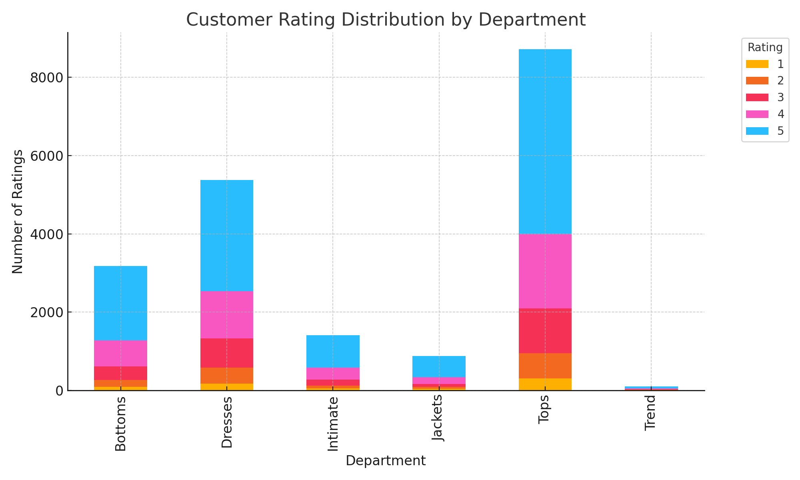

# E-Commerce Data Analysis Tool

A command-line Python application that analyzes e-commerce customer reviews and ratings to uncover department-level trends, age-based preferences, sentiment insights, and product popularity; all through a streamlined, text-based interface.

---

## Project Overview

This tool empowers users to explore customer review data through a command-line interface. It enables role-based access and performs targeted analyses including sentiment breakdowns, rating trends, and product popularity.

---

## Features

-  **Role-Based Access**:
   - Admin: Secure login and employee account creation.
   - Employee: Access data analytics operations.

-  **Core Functionalities**:
   - **Rating Analysis**: Visualize rating breakdowns by department.
   - **Age-wise Preferences**: Discover department preferences by age groups.
   - **Sentiment Analysis**: Categorize positive/negative feedback and visualize trends.
   - **Most Reviewed**: Identify which departments receive the most customer attention.

-  **Visual Outputs**:
   - Graphs and charts are generated using `Matplotlib`.

---

## Dataset

- **File**: `ECommerce_Dataset_converted.csv`
- Contains anonymized review data from a women's clothing e-commerce platform.

---

## Terminal Snapshot

Here's a simulated view of the application interface:

```
python main.py

Welcome to the E-Commerce Data Analysis Tool

Login as:

1. Admin

2. Employee

2
Enter username: john_doe
Enter password: ********

Login successful!

Choose an operation:

1. Rating Analysis

2. Age-wise Department Preferences

3. Sentiment Analysis

4. Most Reviewed Products

1
Select Department: Dresses

Rating Analysis for Dresses:
★☆☆☆☆ : 12
★★☆☆☆ : 34
★★★☆☆ : 105
★★★★☆ : 210
★★★★★ : 354
```


---

## Sample Graph: Rating Distribution by Department

This chart shows how customers rated products across different departments.



---

## Technologies Used

- Python 3
- CSV File Handling
- Matplotlib
- Text-based Authentication System

---

## Future Enhancements

- Add exception handling using `try-except` blocks.
- Support admin account creation.
- Limit feedback output to the top 5 results for better readability.

---

## Lessons Learned

- Structured data parsing using Python.
- CLI-based user access control systems.
- Visual storytelling through data analysis.


